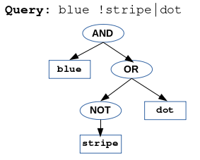
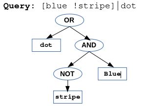
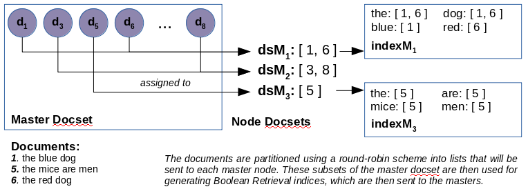
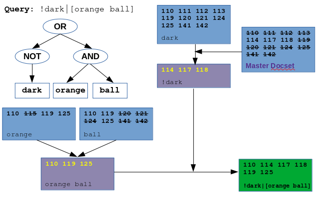

# Summary
## Introduction
### About Redis
Redis is a non-relational database management system with basic data structure support for lists, hashes, sets, and ordered sets (referred to as zsets). Documents are not tied together as relations, but are stored in the form of key-value pairs. It can be configured to run as a cluster, where there are multiple 'nodes' that handle executed commands to the system. _(The minimal cluster is 3 masters with 3 workers, each worker backing up a unique master.)_ Redis offers two advantageous features - sharding and replication.

#### Replication
Redis clusters operate with two types of nodes - masters, and workers. Master nodes accept new data and negoatiate queries that the user executes, with queries being commands such as `hset` or `lpush`. Worker nodes communicate with their corresponding masters, and maintain replicated copies of the data that the master nodes contain. Nodes typically synchronize with the cluster on startup, and workers ping their masters for updates to replicated data on a regular interval.

If a master isn't heard from, then the worker node will take over the place of the master, accepting queries and updating the data stored as more is pushed. When the original master node is returned to the cluster, it will then take the original place of the worker, and maintain a replica of the new data.

#### Sharding
Sharding, usually done automatically by Redis, is implemented in the form of keyslots. Given that Redis stores values as key-value pairs, the master node the pair is stored on is contingent on the slot the key hashes to; however, for the purposes of this project, this feature is overriden by usage of another feature - hash tagging.

Hash tagging is the inclusion of a value that you wish the key to be hashed to within `{}`. For example, `{yum}example` will hash to the same slot as `yum`, or `{add}orange` will hash to the slot for `add`; however, `example` or `orange` alone will hash to the slots those two terms take, respectively. Forcing key-value pairs to specific nodes is as easy as knowing a key that hashes to a specific slot on that node.

Redis hashes keys to any of 16,384 key slots. In regards to a cluster, each master node is responsible for a portion of these keys. For example, in a classical 3-master, 3-worker cluster, each master is responsible for approximately 5,400 slots.

### Goals
There were a couple of questions investigated:
  + Could a Boolean Retrieval index be efficiently queried using Redis set operations
  + Could a Redis cluster be used to offer availability via replication
  + Could documents be partitioned using Redis' sharding capacities

The Boolean Retrieval index being constructed would regard the Project Gutenberg corpora from the WWW, comprised of over 50k documents originally at 20 GB of disk space.

## Procedure
### Corpus Cleaning
The first major step was cleaning the Gutenberg corpora (http://www.gutenberg.org/files/), and reducing the number of files and space that they take (as well as minimalizing redundant processing using Redis). The following steps were performed:
  + Gutenberg Project licensure was migrated from the end of each document to a new document in a separate folder, as to preserve the license as per its terms.
  + Documents were segmented, by ID, in groups of 1,000 into directories - for example, `0-1` storing files with IDs of 000 to 999.
  + Languages were extracted from the documents, and they were segmented by language. All languages other than English were extracted from the corpora.
  + Some select documents, whose content was unusable for the project, were partitioned away from the corpora - for example, documents containing human genome and mathematical constant information.
  + Documents that had multiple variants were segmented out, and the alternate versions removed. (The alternate versions were solely different encodings of the files in question.)

After performing processing, instead of taking 50,000+ files and ~20 GB of disk space, the corpus was comprised of ~42,000 files (excluding licenses) and ~16 GB of space.

### Cluster Setup
To setup the Redis cluster, the individual nodes had to be configured, then joined using the following procedure:

  + Redis installation _(requiring root privilege on Linux)_
    + Downloading and extraction of Redis as a TAR.GZ file
    + Running of the script `install_server.sh` in installation files to make Redis run on startup
  + Cluster setup
    + Correction of the configuration file for Redis _(made during the run of `install_server.sh`)_, including a password, master authentication password, and cluster information:
      ```
      requirepass [pass]
      masterauth [pass]
      port 6379
      cluster-enabled yes
      cluster-config-file /nodes.conf
      cluster-node-timeout 5000
      appendonly yes
      ```
    + Creation of the cluster using redis-cli
      + `redis-cli --cluster create [node]:[port] ... [node]:[port] --cluster-replicas 1 -a [pass]` created the cluster. `[pass]` was required because of the presence of the requirepass field in the configuration file
      + `redis-cli --cluster check [node] [port] -a [pass]` checked the status of the cluster

After executing these steps, a basic 3-master, 3-worker cluster was running, with each worker replicating a unique master. The port for connection was the default - 6379 - with the port the nodes use to communicate amongst each other being 16379. The cluster also required a password for executing commands, adding a little security.

### Program Development
The following was done in setup:
  + The Python library `redis-py-cluster` was installed to interface with Redis
  + A Query class was made for parsing B.R. queries - syntax is discussed below
  + One key was discerned, per master, for forcing documents to those respective nodes (using one of the below methods)
    + Using the command `cluster keyslot <key>` in redis-cli
    + Using the redis-py-cluster library

Main program steps:
  1. After establishing a successful connection to Redis, the user was allowed to enter the location of corpora documents.
  2. A list of document IDs was accumulated, and a partition for each master node done using a round-robin scheme.
  3. Each subset of the master docset was then processed - aka each master node's document set - with normalization performed.
  4. Data was pushed to the server, and then querying could begin using special commands.

Note was made, during development, about a pattern in the Gutenberg Corpora about metadata tags at the top of a file, including, but not limited to the title of a document, authors of a document, and release date. This information was maintained and stored using hashes, allowing a title to be fetched if it was a result in a boolean retrieval query.

#### Text Normalization
During document processing, the following operations were performed:
  + Lowercasing of each word, and stemming using Porter Stemmer, available at http://www.tartarus.org/~martin/PorterStemmer
  + All characters other than a-z, `<space>`, and single hyphens were removed; sequences of two hyphens were replaced by spaces
  + Stop words, such as 'the', 'and', and 'of', were disregarded, with the list used courtesy of https://kb.yoast.com/kb/list-stop-words/

#### Query Syntax
The basis of the querying syntax was that `<space>`, `|`, and `!` represented the operations of and, or, and not, respectively. Grouping of subqueries could be done using `[]`, and precedence of operations was given to grouping, and, or, and not. For example, `blue !stripe|dot` is parsed as `blue AND (NOT stripe OR dot)`, not `(blue AND NOT stripe) OR dot` (which is `[blue !stripe]|dot`).

<div style="text-align: center;">
  
 <p><i><b>Figures 1-a and 1-b</b>: Sample query parse trees, showing precedence and grouping</i></p>
</div>

This parsing of queries, as trees, made resolution of them much more simplistic, relying on a recursive definition and intermediate storage of results in Redis as temporary key-value pairs for efficiency. See **Figure 3** below.

<div style="text-align: center">
  
  <p><i><b>Figure 2</b>: Round-robin and Boolean Retrieval indexing procedure. Take notice the round-robin scheme evenly distributes documents amongst the master nodes</i></p>
</div>

<div style="text-align: center">
  
  <p><i><b>Figure 3</b>: A sample query execution based on the query's parse tree. To solve the query, its parts are recursively solved, and those results stored intermediately in Redis as temporary key-value pairs. The green block is the final result.</i></p>
</div>

### Master Failover Test
After ensuring the program worked, testing the replication of the application was priority. This was done by using a special command in the program, `~sys`, to discern which nodes were master nodes in the cluster, with the first being selected for failover. The following procedure was done, with terms such as `happy` and `joy` used to discern if the documents for the failed master were still accessible.
  + The master node to be failed over was accessed using SSH via terminal. At the same time, the application was up and running to the point of query execution.
  + The command `~sys` was run to ensure the master node was recognized as alive, with `~docset` being used to ascertain which documents were on that node. A simple query, such as `happy`, was then run and results documented.
  + The master was failed over using the below commands:
    ```
    redis-cli -a [pass]  (Via terminal)
    shutdown save        (In redis-cli)
    ```
    Afterward, the same queries were executed to test if the results were the same. The master was revived using SSH with the command `redis-server ./cluster/redis.conf --daemonize yes`, where `.cluster/redis.conf` is the configuration file from prior cluster setup.

Testing was done using queries that were guarenteed to have more than 10 documents in their results, as this would assert that at least 1 document ID would be on the failed over master node, given that a subset of 15 documents was used for testing - 5 per master node. See **Supplements > Master Failover test: Program Output** below.

## Conclusion
+ A Boolean Retrieval index could successfully be constructed and queried using set operations in Redis. Not explained earlier is the concept of using Redis' set intersection operation for and, union for or, and difference for not.
+ Documents were able to be partitioned using Redis' hash tagging feature and known, specific key slots allocated to each of the master nodes. The workers synchronized successfully with their corresponding master nodes, replicating the data and offering data reliability on the failover of a master.

## Supplements
### Query Execution Example
The following program output is an execution of the query `!dark|[orange ball]` in steps. For posterity, `~docset` is also executed to showcase the set of documents that were present in the system at the time of execution.

```
Connecting to server...
Connection successful
Clear the database? (y/n) > n
Load corpus data? (y/n) > n

Type '~stop' to exit querying
Query > ~docset
Document set for master nodes:
  Master 0:
    11 55 58 62 67
  Master 1:
    5 56 60 64 8
  Master 2:
    54 57 61 66 9

Query > dark
There were 10 hits
     11 : Alice's Adventures in Wonderland
     54 : The Marvellous Land of Oz
     55 : The Wonderful Wizard of Oz
     57 : Aladdin and the Magic Lamp
     58 : Paradise Regained
     60 : The Scarlet Pimpernel
     62 : A Princess of Mars
     64 : The Gods of Mars
     66 : The Dawn of Amateur Radio in the U.K. and Greece
     67 : The Black Experience in America

Query > !dark
There were 5 hits
      5 : The United States' Constitution
     56 : NREN for All: Insurmountable Opportunity
     61 : The Communist Manifesto
      8 : Lincoln's Second Inaugural Address, March 4, 1865
      9 : Lincoln's First Inaugural Address, March 4, 1861

Query > orange
There were 3 hits
     11 : Alice's Adventures in Wonderland
     54 : The Marvellous Land of Oz
     60 : The Scarlet Pimpernel

Query > ball
There were 6 hits
     11 : Alice's Adventures in Wonderland
     55 : The Wonderful Wizard of Oz
     60 : The Scarlet Pimpernel
     62 : A Princess of Mars
     64 : The Gods of Mars
     66 : The Dawn of Amateur Radio in the U.K. and Greece

Query > orange ball
There were 2 hits
     11 : Alice's Adventures in Wonderland
     60 : The Scarlet Pimpernel

Query > !dark|[orange ball]
There were 7 hits
     11 : Alice's Adventures in Wonderland
      5 : The United States' Constitution
     56 : NREN for All: Insurmountable Opportunity
     60 : The Scarlet Pimpernel
     61 : The Communist Manifesto
      8 : Lincoln's Second Inaugural Address, March 4, 1865
      9 : Lincoln's First Inaugural Address, March 4, 1861

Query > ~stop
```

### Master Failover Test: Program Output
The following is program output from Redis when the master failover test was performed, with a simplistic query performed to showcase the replication features made the database realiable. Take notice:
  + The first master on the first useage of `~sys` is **150.216.79.32**; however, after the master was turned off, the first master is listed as **150.216.79.35**. The number of workers also changes from 1 to 0.
  + After the master is brought back - the third usage of `~sys` - the number of workers changes from 0 back to 1; however, the first master listed is still **150.216.79.35**. The node with an ending octet of **32** is now the worker of **35**.
  + There is output, on the second attempt to query the cluster, of something having gone wrong; this is due to the connection recognizing one of the master's is down, and requires a refresh of what nodes are in the cluster.

```
[mnmorgan@dhcp-10-35-54-160 redis]$ python3 main.py
Connecting to server...
Connection successful
Clear the database? (y/n) > n
Load corpus data? (y/n) > n

Type '~stop' to exit querying
Query > ~sys
Database Master Nodes
  150.216.79.32:6379 -> 7041 keys
    Memory: (Cur\Ttl -> 3.87M \ 7.64G), (RSS\LUA -> 14.74M \ 37.00K)
    Workers: 1
  150.216.79.34:6379 -> 8235 keys
    Memory: (Cur\Ttl -> 4.55M \ 7.64G), (RSS\LUA -> 18.12M \ 37.00K)
    Workers: 1
  150.216.79.33:6379 -> 9640 keys
    Memory: (Cur\Ttl -> 4.99M \ 7.64G), (RSS\LUA -> 161.61M \ 37.00K)
    Workers: 1

Query > ~docset
Document set for master nodes:
  Master 0:
    11 55 58 62 67 
  Master 1:
    5 56 60 64 8 
  Master 2:
    54 57 61 66 9 

Query > arm
There were 14 hits
     11 : Alice's Adventures in Wonderland
      5 : The United States' Constitution
     54 : The Marvellous Land of Oz
     55 : The Wonderful Wizard of Oz
     57 : Aladdin and the Magic Lamp
     58 : Paradise Regained
     60 : The Scarlet Pimpernel
     61 : The Communist Manifesto
     62 : A Princess of Mars
     64 : The Gods of Mars
     66 : The Dawn of Amateur Radio in the U.K. and Greece
     67 : The Black Experience in America
      8 : Lincoln's Second Inaugural Address, March 4, 1865
      9 : Lincoln's First Inaugural Address, March 4, 1861

Query > ~sys
Woops... Something went wrong; hold on a moment...
Woops... Something went wrong; hold on a moment...
Woops... Something went wrong; hold on a moment...
Woops... Something went wrong; hold on a moment...
Database Master Nodes
  150.216.79.35:6379 -> 7041 keys
    Memory: (Cur\Ttl -> 3.84M \ 7.64G), (RSS\LUA -> 14.48M \ 37.00K)
    Workers: 0
  150.216.79.34:6379 -> 8235 keys
    Memory: (Cur\Ttl -> 4.53M \ 7.64G), (RSS\LUA -> 18.12M \ 37.00K)
    Workers: 1
  150.216.79.33:6379 -> 9640 keys
    Memory: (Cur\Ttl -> 4.98M \ 7.64G), (RSS\LUA -> 161.61M \ 37.00K)
    Workers: 1

Query > arm
There were 14 hits
     11 : Alice's Adventures in Wonderland
      5 : The United States' Constitution
     54 : The Marvellous Land of Oz
     55 : The Wonderful Wizard of Oz
     57 : Aladdin and the Magic Lamp
     58 : Paradise Regained
     60 : The Scarlet Pimpernel
     61 : The Communist Manifesto
     62 : A Princess of Mars
     64 : The Gods of Mars
     66 : The Dawn of Amateur Radio in the U.K. and Greece
     67 : The Black Experience in America
      8 : Lincoln's Second Inaugural Address, March 4, 1865
      9 : Lincoln's First Inaugural Address, March 4, 1861

Query > ~sys
Database Master Nodes
  150.216.79.35:6379 -> 7041 keys
    Memory: (Cur\Ttl -> 3.87M \ 7.64G), (RSS\LUA -> 14.48M \ 37.00K)
    Workers: 1
  150.216.79.34:6379 -> 8235 keys
    Memory: (Cur\Ttl -> 4.55M \ 7.64G), (RSS\LUA -> 18.12M \ 37.00K)
    Workers: 1
  150.216.79.33:6379 -> 9640 keys
    Memory: (Cur\Ttl -> 4.99M \ 7.64G), (RSS\LUA -> 161.61M \ 37.00K)
    Workers: 1

Query > ~stop
```